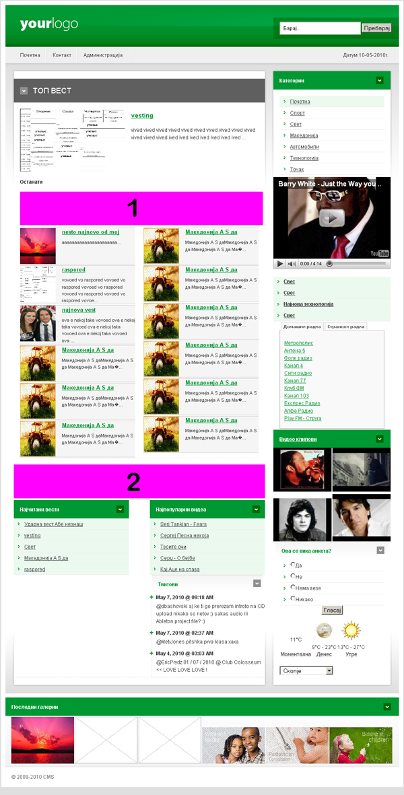

EasyCMS - Version 1.0

How to install?

1. Create a new MySql database of your choice, ex. cms 
2. Extract the files from EasyCMS.zip.
3. Upload all files to you root folder of your website.
4. Open your website for example http://your-web-page.com/
5. You open the installation page, enter the name of the database ex. cms, enter the username and password and click install.
6. Installation is complete
7. Open the administrative section and log in with username: admin and password: admin
8. Enjoy!

